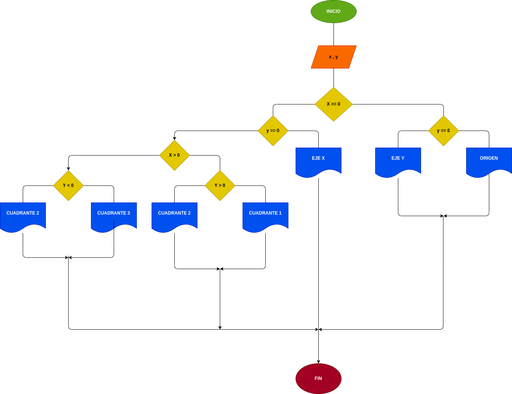

# Cordenadas cartecianas

## Programa para saber la ubicacion exacta de "x, y" en un plano carteciano 

---

# ANALISIS

Variable de entrada (imput)

x: un numero que se encuentra en un punto del plano carteciano

y: un numero que se encuentra en un punto del plano carteciano

---

Variable de proceso y salida (processing, storage, output)

x == 0: se usara para saber si el numero es cero

y == 0: se usara para saber si el numero es cero

x > 0: se usara para saber si el numero es mayor a cero

y > 0: se usara para saber si el numero es mayor a cero

y < 0: se usara para saber si el numero es menor que cero

---

# DISEÑO

---

---

# CONSTRUCCION 