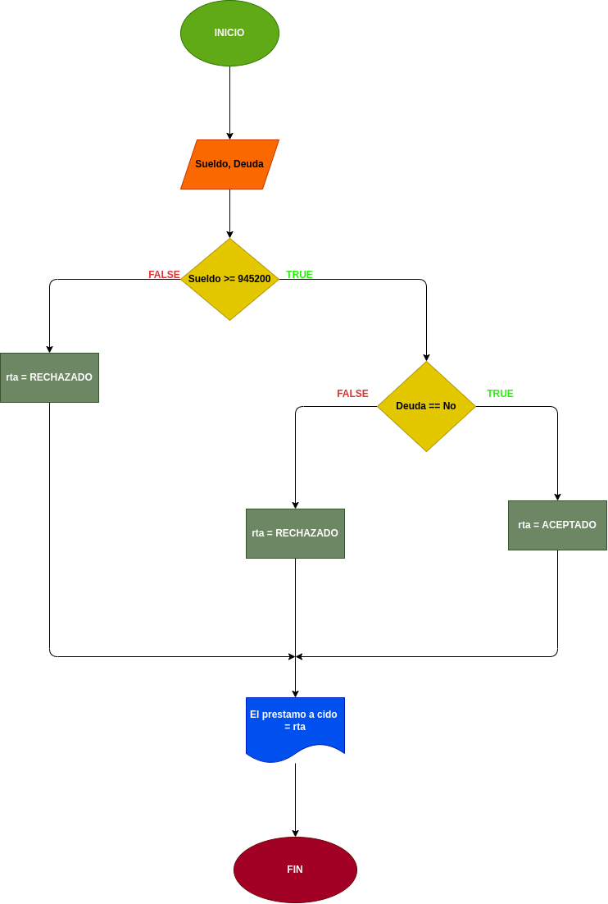

# Prestamos Bancarios
## Programa que permita realizar un préstamo bancario,

---

# ANALISIS

---

Variables de entrada (input)

- Sueldo: se utilisara para saber la cantidad de sueldo que tiene el usuario

- Deuda: se usara para saber si el usuario tiene o no deudas

Variables de proceso y salida (processing, storage, output)

- Sueldo >= 0: se usara para comprobar si el sueldo del usuario supera los $945200

- Deuda == No: se usara para aceptar o denegar el prestamo al usuario dependiento que responda

---

# DISEÑO

