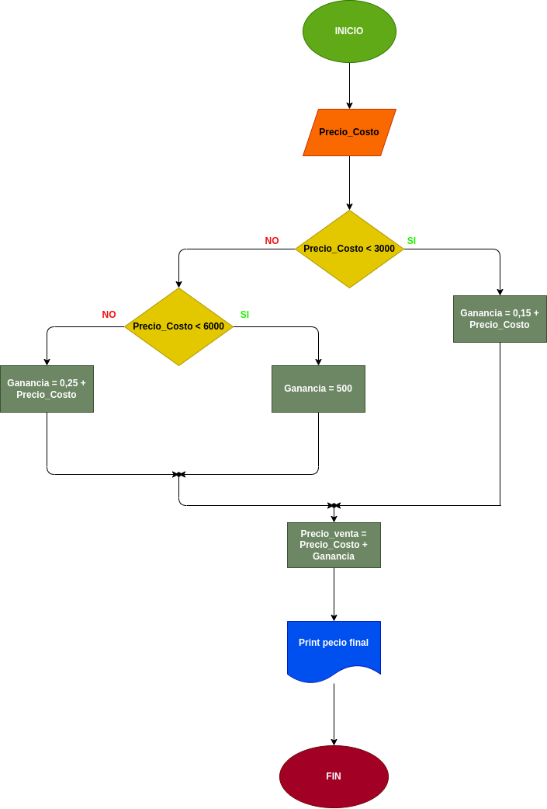

# Precio Venta
## Programa que indica el precio de venta de un articulo dado

---

# Analisis

Variables de entrada (input)

- Precio_Costo: lo que vale el articulo 

Variables de proceso y salida (processing, storage, output)

- Precio_Costo < 3000:

- Precio_Costo < 6000:

---

#Diseño

