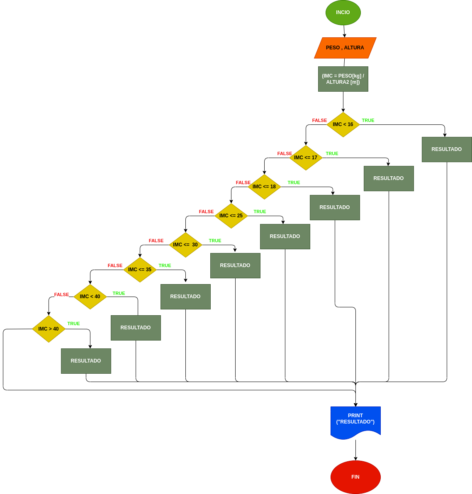

# Masa Corporal
## Programa que calcula el indice de masa corporal "IMC" de una persona por medio de su peso y estatura

---

# Analisis

Variables de entrada (input)

- Peso = Su peso integrado 

- Altura = su altura integrada

Variables de procesoy salida (processig, storage, output)

- Resultado = son los resultados de su indice de peso

- IMC y Resultado = sueltan su indice de peso y el resultado de estos

---

# Diseño

