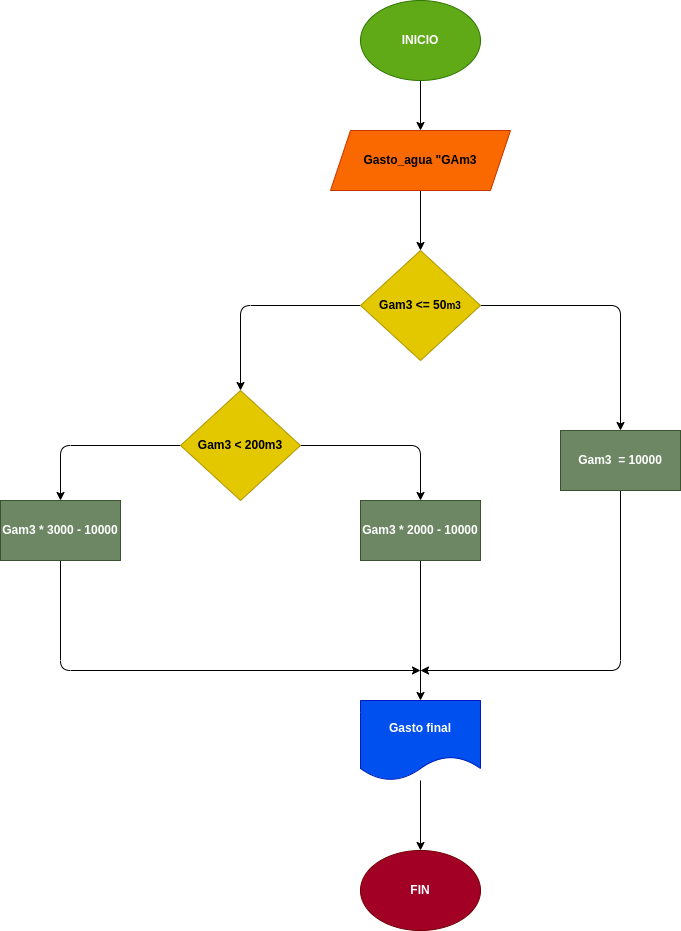

# Gasto del agua
## Programa para calcular el gasto de agua de una vivienda

---

# Analisis

Variables de entrada (input)

- Gasto_agua

Variables de Proceso y salida (processing, storage, output)

- Pago = es el precio a pagar dependiendo del consumo de agua de la vivienda

- Pago = es el monto requerido por la empresa a pagar

---

# Diseño

