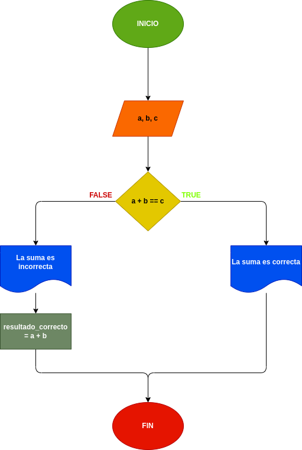

# Determinar un numero entero
## Programa para determinar si dados tres números enteros, la suma de los dos primeros es igual al tercero.

---

# Analisis 

Variables de entrada (imput)

- a : es el primer digito de la suma

- b : es el segundo digito de la suma

- c : es el resultado de los digitos a + b

Variables de  Proceso y salida (processing, storage, output)

- a + b == c: es la operacion que sumara los digitos que pusimos en "a" y "b"

- resultado_correcto = a + b : si el resultado que pongamos en la "c" es incorrecto, esta variable me corregira

---

# Diseño

