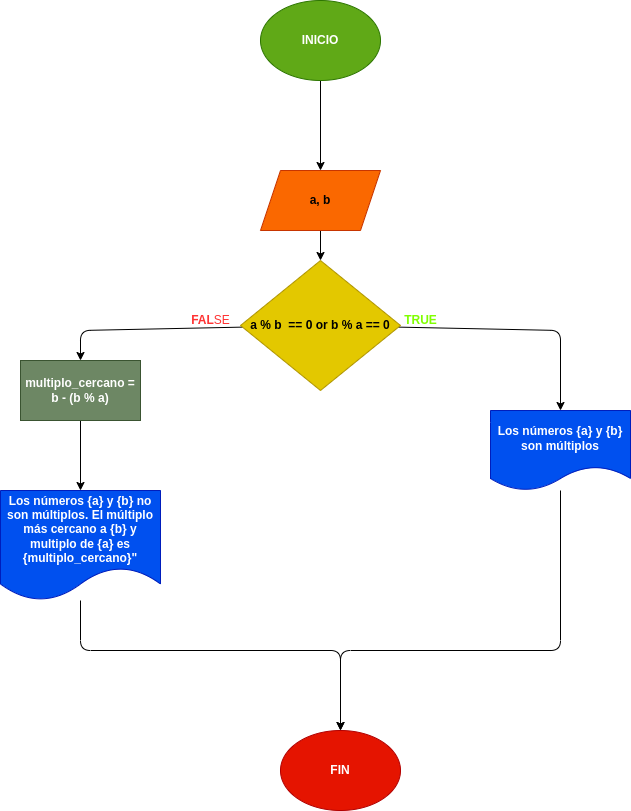

# Multiplos enteros
## Programa que lea dos números enteros y averigüe si el uno es múltiplo del otro.

---

# Analisis

Variables de entrada (imput)

- a : Es un numero el cual le sacaremos el multiplo

- b : Es el multiplo de "a"

Variables de  Proceso y salida (processing, storage, output)

- a % b == 0 or b % a == 0 : se usara para ver si los 2 numeros son multiplos

- multiplo_cercano = b - (b % a) : en dicho caso que el multiplo sea incorrecto estolo corregira y pondra el multiplo correcto de "a" mas sercano a"b"

---

# Diseño

